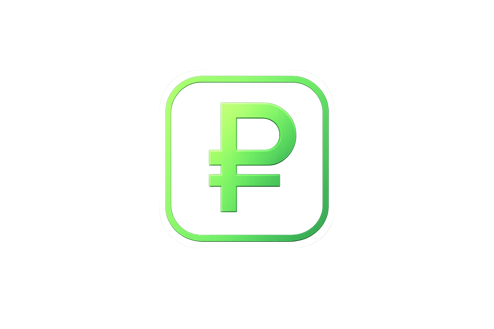

# 💸 Parcelas

<p align="center">
  
</p>

<p align="center">
  <b>Gerenciador financeiro desktop para controle de gastos e faturas.</b>
</p>

<p align="center">
  <a href="#funcionalidades">Funcionalidades</a> •
  <a href="#tecnologias">Tecnologias</a> •
  <a href="#como-rodar">Como Rodar</a> •
  <a href="#licença">Licença</a>
</p>

---

## 🚀 Sobre o Projeto
O **Parcelas** é uma aplicação desktop desenvolvida para oferecer controle total sobre gastos no cartão de crédito. Com ele, você não apenas registra compras, mas calcula automaticamente o impacto de parcelas em faturas futuras, evitando surpresas no final do mês. 


## ✨ Funcionalidades
- [x] **Gestão de Cartões:** Cadastro dinâmico com cálculo de datas de fechamento e vencimento.
- [x] **Rastreador de Compras:** Registro de compras com divisão inteligente de parcelas.
- [x] **Painel de Faturas:** Visualização mês a mês de todas as obrigações financeiras.
- [x] **Dashboard Dinâmico:** Gráfico de gastos anuais em tempo real via SVG nativo.
- [x] **Relatórios Analíticos:** Gráfico de rosca (Donut Chart) para divisão de gastos por categorias.
- [x] **CRUD Completo:** Criação, leitura, atualização e exclusão de qualquer registro financeiro.
- [x] **Notificações Premium:** Sistema de Toast notifications para feedback imediato.

## 🛠️ Tecnologias
Este projeto foi construído utilizando tecnologias de ponta:
* **[Electron](https://www.electronjs.org/):** Framework para aplicações desktop.
* **[React](https://reactjs.org/):** Interface de usuário reativa e performática.
* **[TypeScript](https://www.typescriptlang.org/):** Tipagem estrita para maior segurança do código.
* **[SQLite](https://www.sqlite.org/):** Base de dados relacional leve e local.
* **[Vite](https://vitejs.dev/):** Ferramenta de build ultra-rápida.

## 📦 Como Rodar
Para executar este projeto na sua máquina:

1. **Clone o repositório:**
   ```bash
   git clone [https://github.com/SEU_USUARIO/parcelas.git](https://github.com/SEU_USUARIO/parcelas.git)
